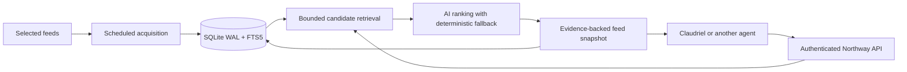

# Architecture

Status: Phase 1 architecture contract. Runtime and initial SQLite corpus storage are implemented; the remaining feed-service design is still planned. See [storage scope](storage.md) and [roadmap](roadmap.md) for implemented versus future behavior.

## Product boundary

Northway owns contextual retrieval, ranking, grounded explanations, source provenance, feed definitions, explicit preference/feedback state, and service usage controls. Its output must be useful to a generic authenticated agent.

Claudriel owns personal memory, repository inspection, the active project/task, selection of context to disclose, and the user interface. It can author/edit feed definitions through the API and further synthesize results. Northway must not require access to its entities, filesystem, PHP framework, or agent runtime.

This extends the earlier personal-only idea: contextual AI ranking belongs in the product, while private context selection stays in the client. Other agents can therefore substitute for Claudriel.

## Initial runtime

One Go module with packages for sources, articles, feeds, retrieval, ranking, feedback, identity and usage. The same application supports HTTP and ingestion commands, but the deployed pilot runs its bounded scheduler inside the API process. Start with one process and an embedded SQLite database on local storage; prevent overlapping jobs and retain durable checkpoints. Use FTS5 candidate retrieval before introducing another search service.

SQLite is the initial choice to minimize resource and operations overhead. It supports the planned personal pilot and a small single-instance SaaS, but permits one writer at a time and has no database row-level security. Tenant enforcement is explicit application/query logic plus constraints and integration tests. See [SQLite usage guidance](https://www.sqlite.org/whentouse.html) and [WAL limitations](https://www.sqlite.org/wal.html). PostgreSQL remains an option if sustained lock contention, multi-host workers or availability requirements justify a migration.

No always-on AI sidecars. Use a model-provider interface invoked on a bounded shortlist. Initially allow at most one model call per cache miss, cap article text and output size, validate item IDs/evidence references and fall back on timeout, invalid output or budget exhaustion. Never fetch the entire web synchronously to satisfy a query.

## Tenant and data model

- tenants and api_keys: credential identity, scopes, revocation, budget and policy. Store key hashes, never raw keys in database/logs.
- sources and source_observations: canonical source identity, poll state, timestamps, failure state, rights and visibility. Public content may be shared only where rights/entitlements allow it. Private-source content stays in its tenant scope.
- articles and article_versions: canonical URL, stable internal identity, origin identifiers, title, permitted text/excerpts, publication time when known, observation time, content hash and provenance. Track updates; a URL being seen once must not permanently suppress changed content.
- feeds and feed_revisions: tenant-owned source selection, intent, exclusions and ranking preferences. Cross-tenant relations must be prevented by constraints as well as queries.
- snapshots: tenant-owned ordered result set with feed/corpus/context/ranking revision, coverage state and expiry.
- feedback: tenant-owned snapshot/item preference events with client idempotency key and explicit reversal.
- usage: bounded request, acquisition, model-token and storage records; metering exists before billing.

Derive tenant identity from credentials; never trust a tenant_id supplied in the request. Authorize every feed, snapshot and feedback object. An opaque ID is not authorization. See [OWASP object-level authorization](https://owasp.org/API-Security/editions/2023/en/0xa1-broken-object-level-authorization/).

SQLite has no RLS or server roles. Every private repository method requires an authenticated tenant argument and every SQL read/update/delete includes tenant scope; composite foreign keys prevent cross-tenant attachments. No feature can access a raw database handle outside the storage adapter. Test missing tenant, wrong tenant, batch paths, FTS joins and cache access. This is weaker defense in depth than database-enforced RLS and is an explicit accepted pilot tradeoff.

## AI and privacy

Optional [scheduled discovery](specs/scheduled-discovery.md) uses an external web-search-capable provider to acquire cited candidates. This acquisition adapter is separate from the tool-free ranker below, with distinct query/search budgets and provenance. It may use only bounded provider-side search, never local execution. Scheduled digest generation writes cached snapshots for clients to pull.

The agent sends a small explicit context envelope: intent, language/framework/dependency names and versions when known, and optional focus topics. No automatic repository upload, conversation dump or inferred access to other projects. Dependencies can themselves be sensitive; clients choose what to disclose. Do not log raw context by default.

Article text is data, not instructions. The ranker gets no browsing, filesystem, shell or source-management tools. Provider output must reference only permitted candidate IDs; generated facts/explanations must be supported by available evidence. Say when feed-only text is insufficient to establish compatibility or impact. Never claim a dependency is vulnerable merely because an article mentions its name.

Cache keys include tenant, feed/preference revision, source entitlements, normalized context digest, corpus revision and ranker/model version. Do not share personalized output across tenants or place raw context in a cache key. Shared public article parsing is a separate cache with no personal input.

Initial retention proposals: articles 90 days where allowed, raw diagnostics at most 7 days, snapshots 7 days; keep normalized context only as long as required to serve the snapshot, and meter without retaining prompt text. Tenant policy and content rights can shorten retention. Saved user evidence requires an explicit separate retention decision.

## Feed behavior

The initial host is a Raspberry Pi; hardware details and final budgets require device validation. See [content sourcing](content-sources.md). No crawling, article-page fetching or browser rendering runs at home. Feed polling uses ordinary outbound HTTPS; if that is also disallowed, collection moves to an external source and the Pi pulls normalized batches. Optional inference runs remotely; deterministic retrieval remains usable without it.

Use conditional HTTP requests and persistent poll state. Respect source rate limits, robots/site policy where applicable, request/body bounds and retry backoff. Approved sources are configured by an operator for Phase 1. All fetches validate destinations and redirects; customer-controlled source URLs require a hardened public-network-only fetch path before enablement.

Return source publication time only if known; never substitute fetch time and label it as publication. Report partial coverage and stale observations rather than interpreting missing data as no news. At first, use feed descriptions/text; full article access is an explicit later capability.

## Resource and cost controls

Start with 5–10 sources, one concurrent feed fetch, bounded candidate and result counts, and one provider call per uncached query. Measure RSS, CPU, storage growth, latency, source freshness and provider usage. Reserve tenant budget atomically before model calls so concurrent requests cannot overrun it. Cache hits, retries, failures and provider tokens have separate counters.

Use bounded structured logs, last-success/error metrics and restore-tested backups. Add dedicated infrastructure only after a measured limitation. Initial 1 GiB host target is unverified and excludes remote inference charges.
