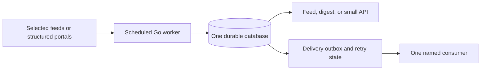

> Historical audit and initial options. The current [architecture](architecture.md), [content policy](content-sources.md), and [roadmap](roadmap.md) supersede the early boundary/budget proposals below: Northway is now an independent agent-facing service, SQLite/Pi first, with optional external AI discovery and no home crawling.

# North Cloud: resource and usefulness audit

Audit date: 2026-08-30 (America/Toronto). Code reviewed: `51b877de7dab311c981dcdb4d38dfdca9965aeb1`, current GitHub `main` when checked.

## Clarified product direction

During the audit, the user selected the immediate use case: **AI-first personal contextual news feeds inside Claudriel**. Claudriel is the harness and operating system; a smaller service assembled from North Cloud provides news relevant to the active project. The PHP-project example should drive the first pilot. The broader product alternatives below record the initial audit reasoning, not competing launch commitments.

Current Claudriel `main` was inspected separately at `e87c907e83047f7c8dd4d72380b8712511314c19`. It already has project/workspace context providers, PHP-backed agent tools, and brief-panel components. Its existing North Cloud fetcher is a leads integration, not a contextual-news API. Proposed boundary: Claudriel owns personal preferences, authorized project context, AI selection/explanation, feedback and presentation; the reduced service owns source polling, canonical articles, deduplication, retention and candidate retrieval. AI-enriched article metadata can be added and cached if evaluation justifies it.

Start with one PHP workspace, 5–10 explicitly selected sources, a contextual-news tool and a panel showing at most five items with evidence-backed relevance explanations. Extract only approved technical signals from manifests; do not transmit repository contents, secrets, or whole conversations to the feed service. Source content remains untrusted data. No implementation or deployment has been started.

## Recommendation

Preserve North Cloud's source knowledge, extraction rules, taxonomy, and ingestion contracts. Relaunch one narrow service that collects useful updates from a small, deliberately chosen source list and produces a feed or digest. Do not restart the entire experimental platform or undertake a whole-repository rewrite first.

For the new small product, aim for one scheduled Go worker, one database, and one retrieval API consumed by Claudriel. The recommendation is a reversible two-week contextual-news pilot. The RFP/opportunity path is a reusable capability to park, not part of this first launch.

There are two distinct paths:

| Path | What it preserves | Initial machine budget to test | Assessment |
|---|---|---|---|
| Smaller existing pipeline | Existing crawler/classifier/publisher/search behavior, Elasticsearch, compatibility with current consumers | 2 vCPU / 4 GiB RAM, small corpus, bounded concurrency | Lower migration risk, but still many moving parts. Use if an existing consumer needs the current contracts. |
| Focused scheduled product | Selected source adapters, rules and metadata; a new compact storage/output path | 1 vCPU / 1 GiB for a SQLite worker-only pilot; 2 GiB if using PostgreSQL plus a small web/API process | Recommended direction if nothing currently depends on the full pipeline. Requires implementation and validation; not an existing deploy mode. |

These are **engineering targets, not measured requirements or promised savings**. Full historical data, browser-heavy sources, traffic, indexing peaks, and backups may require more. Do not buy a host or set hard limits from this table alone.

## What was verified

- Located the local WSL repository at `/home/fsd42/dev/north-cloud`.
- Compared it to GitHub: the checkout was 314 commits behind. On request, fast-forwarded `main` from `c8b88976` to `51b877de`.
- Preserved the leftover local files `dashboard-waaseyaa/storage/framework/packages.php` and `dashboard-waaseyaa/waaseyaa.sqlite`. They became visible as untracked files after upstream removed the dashboard directory. No local data was deleted.
- Reviewed the current merged base + production Compose model using Compose v5.1.4, with interpolation disabled and an empty environment file. The environment file containing deployment secrets was not read.
- Traced acquisition, classification, storage, routing, scheduled producers, and selected tests and migrations.
- Inspected the existing local Docker stack without restarting it, executing migrations, publishing messages, crawling sources, or querying production.

This is an architecture/resource and product-scope audit, **not** a complete security audit, dependency-vulnerability scan, load test, or production capacity assessment. Go application tests were not executed. Existing test files were inspected where relevant. An independent audit copy was also created under the task's scratch directory before the checkout update was authorized.

## The footprint

The merged configuration contains **45 service definitions**. **39 have no profile**, so they are eligible for a default startup; this includes three one-shot jobs and an idle MCP container, not 39 continuously busy processes. Five observability services are opt-in. Container Redis is under a disabled profile because production expects host Redis. Docker documents the default/profile distinction in its [Compose profiles guide](https://docs.docker.com/compose/how-tos/profiles/).

| Component group | Declared memory limits |
|---|---:|
| Elasticsearch | 8 GiB; default JVM heap 4 GiB |
| Seven service PostgreSQL instances + Umami PostgreSQL | 3.75 GiB |
| Five classification sidecars | 3.5 GiB |
| MinIO | 2 GiB |
| Two browser renderers | 1.5 GiB |
| Remaining capped, unprofiled services | 5.875 GiB |
| **Sum of specified limits without profiles** | **24.625 GiB** |
| Optional observability stack | Additional 2 GiB |

The limits are ceilings, **not reservations and not actual RAM consumption**. Four unprofiled definitions have no memory cap: ai-observer, alert-crawler, mcp-north-cloud, and minio-init. Host Redis, operating-system overhead, build jobs, external PHP applications, and any other host services are outside these totals. No production `.env`, Ansible deployment state, or billing data was used.

The [service inventory](north-cloud-service-inventory.csv) records every service, profile, limit, restart policy, and declared dependency. The [measurement summary](north-cloud-audit-measurements.json) records the totals and revision.

The local development snapshot was much smaller and incomplete: Elasticsearch used approximately **1,003 MiB of its 1 GiB limit**, PostgreSQL 35 MiB, MinIO 123 MiB, Redis 10 MiB, and rfp-ingestor 13 MiB. Publisher, pipeline, and click-tracker were restarting; each had 622 recorded restarts when inspected, exit code 1, and `OOMKilled=false`. Their zero-byte stats are not useful idle measurements. The root cause was not established. This is not evidence of production usage or of the full application's idle footprint.

## Findings that change the reduction plan

### 1. Optional capabilities are mandatory deployment dependencies

The production classifier waits for all five classification sidecars. Four domain flags are hardcoded true; Indigenous classification defaults true. The crawler waits for both MinIO and the render worker even though HTML archiving defaults off and not every source needs a browser. The MCP container idles but depends on six core services.

Consequently, setting a feature flag does not necessarily remove its container or startup dependency. A small deployment needs an explicit service allowlist, matching feature configuration, and removal of the corresponding dependency edges. Merely adding a profile to a required dependency can make the selected deployment invalid.

Evidence: [classifier dependencies and flags](https://github.com/jonesrussell/north-cloud/blob/51b877de7dab311c981dcdb4d38dfdca9965aeb1/docker-compose.prod.yml#L238), [crawler dependencies and archive settings](https://github.com/jonesrussell/north-cloud/blob/51b877de7dab311c981dcdb4d38dfdca9965aeb1/docker-compose.prod.yml#L29), and [classifier optional execution](https://github.com/jonesrussell/north-cloud/blob/51b877de7dab311c981dcdb4d38dfdca9965aeb1/classifier/internal/classifier/classifier.go#L309).

### 2. Database-per-service does not need to mean server-per-service

Development already runs seven logical databases on one PostgreSQL instance. That offers a proven configuration pattern to adapt for production without first rewriting service repositories or merging their schemas. Keep separate databases and restricted service users; reduce connection-pool totals to fit the shared server. Back up and restore each database, and account for the new shared failure boundary.

Evidence: [shared development PostgreSQL](https://github.com/jonesrussell/north-cloud/blob/51b877de7dab311c981dcdb4d38dfdca9965aeb1/docker-compose.dev.yml#L44) and [database initialization](https://github.com/jonesrussell/north-cloud/blob/51b877de7dab311c981dcdb4d38dfdca9965aeb1/infrastructure/postgres/init-dev.sql). The dev setup is precedent, not a production migration script.

### 3. Elasticsearch is part of the processing pipeline, not just search

The crawler writes source-specific raw indices. The classifier polls them and writes source-specific classified indices. Publisher and signal-producer read those indices. RFP and alert ingestion also write Elasticsearch directly. Removing the public search UI therefore does not remove Elasticsearch.

Raw data is carried into the classified document, including HTML when present, and the body text is duplicated under the publisher-compatible `body` field. That adds storage and payload work, although compression means the disk penalty is not a simple multiplier. Source-specific raw and classified indices also grow index/shard overhead with the source count. Elastic explicitly documents [overhead per index, shard, segment, and field](https://www.elastic.co/docs/deploy-manage/production-guidance/optimize-performance/size-shards).

For the interim pipeline, retain Elasticsearch and benchmark fewer sources, fewer indices, and bounded retention before reducing its heap. For the focused product, put content and processing state in the same relational store and generate search/output from there. This is a real storage and query refactor, not an environment-variable switch.

Evidence: [raw writer](https://github.com/jonesrussell/north-cloud/blob/51b877de7dab311c981dcdb4d38dfdca9965aeb1/crawler/internal/storage/raw_content_indexer.go#L53), [classified document copying and body alias](https://github.com/jonesrussell/north-cloud/blob/51b877de7dab311c981dcdb4d38dfdca9965aeb1/classifier/internal/classifier/classifier.go#L624), [classifier polling](https://github.com/jonesrussell/north-cloud/blob/51b877de7dab311c981dcdb4d38dfdca9965aeb1/classifier/internal/processor/poller.go#L158).

### 4. The raw-content cleanup script is not a working retention guarantee

`setup-ilm.sh` creates a policy but does not attach it to an index or template, and the reviewed shared raw-index mapping sets neither lifecycle name nor rollover alias. The script also removes all whitespace, including newlines, from index lists before trying to replace newlines with commas; multiple names therefore concatenate. It uses `curl -s` without failing on HTTP error responses, so error responses can be followed by a success message.

Do not rely on this script to bound storage. No cleanup was executed. For a pilot, implement and test deletion based on document age and successfully completed processing, or correctly configure rolled indices and policy attachment. Preserve pending/failed items until they can be retried or explicitly quarantined. Raw source HTML should have a short, explicit diagnostic-retention window; evidence deliberately saved by a user needs separate retention.

Evidence: [cleanup script](https://github.com/jonesrussell/north-cloud/blob/51b877de7dab311c981dcdb4d38dfdca9965aeb1/infrastructure/elasticsearch/setup-ilm.sh#L14) and [raw index settings](https://github.com/jonesrussell/north-cloud/blob/51b877de7dab311c981dcdb4d38dfdca9965aeb1/infrastructure/esmapping/raw_index.go#L4). Production may have out-of-repository policies; their existence was not checked.

### 5. Intermittent operation needs durable delivery

Publisher calls Redis `PUBLISH` and records publish history after command success. It does not check whether a subscriber received the item. Redis Pub/Sub has [at-most-once delivery](https://redis.io/docs/latest/develop/interact/pubsub/): an offline subscriber misses the message. The existing durable publish history is a deduplication record, not an acknowledgement from the consumer.

There is a second reliability issue: `pollAndRoute` advances its batch cursor after processing all items even when an individual channel publish failed. A transient failure can therefore leave an item behind the cursor without an automatic retry in the normal routing loop. These are code-path findings, not fault-injection results from a live deployment.

For a new small product, use a transactional outbox and acknowledged HTTP delivery with an idempotency key, or a pull feed with a durable consumer cursor. If current Redis consumers must remain, add replay/acknowledgement or a coordinated Streams migration. Do not silently switch protocols. Make successful publication mean durable consumer acceptance, not just acceptance by the broker.

Evidence: [publish and history handling](https://github.com/jonesrussell/north-cloud/blob/51b877de7dab311c981dcdb4d38dfdca9965aeb1/publisher/internal/router/service.go#L381) and [unconditional cursor advancement](https://github.com/jonesrussell/north-cloud/blob/51b877de7dab311c981dcdb4d38dfdca9965aeb1/publisher/internal/router/service.go#L156).

### 6. Some useful classification is already inexpensive rules logic

The shared framework builds five Python HTTP services, but the current Indigenous module explicitly implements rule-based keyword matching. Do not assume a GPU, hosted LLM, or always-running model server is needed for the first product. Preserve useful rules and evaluate them on real examples; inline or batch the selected rules in the focused worker. The existing classifier has content-type routing and optional-classifier gates worth retaining.

The crawler already supports conditional feed requests using ETag and Last-Modified. Preserve this work instead of rebuilding generic crawling. Start with direct feeds and structured sources; exclude browser-only sources unless a specific source's value justifies their cost.

Evidence: [Indigenous module](https://github.com/jonesrussell/north-cloud/blob/51b877de7dab311c981dcdb4d38dfdca9965aeb1/ml-modules/indigenous/module.py#L1), [feed HTTP client](https://github.com/jonesrussell/north-cloud/blob/51b877de7dab311c981dcdb4d38dfdca9965aeb1/crawler/internal/feed/http_fetcher.go#L20), and [fetcher defaults: 16 workers](https://github.com/jonesrussell/north-cloud/blob/51b877de7dab311c981dcdb4d38dfdca9965aeb1/crawler/internal/config/fetcher/config.go#L8). A pilot should start with 1–2 fetch workers and increase only if freshness requires it.

### 7. Scheduled collectors are useful building blocks, not finished standalone products

RFP ingestion already has a `RunOnce` unit and CanadaBuys/SEAO parsers; it bypasses general article classification. Signal-producer is scheduled every 15 minutes and has checkpointed HTTP delivery. Alert-crawler has RSS parsing, SQLite catalogue state, and lifecycle handling. These are strong reuse candidates.

However, signal-producer and alert-crawler still require Elasticsearch; alert-crawler also publishes through Redis. Signal-producer performs one 100-hit query per run, sorted only by crawl time, with a five-minute lookback. A dense overlap window can repeatedly return the same first page. Validate backlog drainage and timestamp ties before using it as the basis of an intermittently running service; add stable pagination and a tested checkpoint rule.

Evidence: [RFP RunOnce](https://github.com/jonesrussell/north-cloud/blob/51b877de7dab311c981dcdb4d38dfdca9965aeb1/rfp-ingestor/internal/ingestor/ingestor.go#L100), [signal producer query](https://github.com/jonesrussell/north-cloud/blob/51b877de7dab311c981dcdb4d38dfdca9965aeb1/signal-producer/internal/producer/producer.go#L367), [timer](https://github.com/jonesrussell/north-cloud/blob/51b877de7dab311c981dcdb4d38dfdca9965aeb1/signal-producer/deploy/signal-producer.timer), and [alert bootstrap](https://github.com/jonesrussell/north-cloud/blob/51b877de7dab311c981dcdb4d38dfdca9965aeb1/alert-crawler/main.go#L62).

## What to keep, park, and replace

| Capability | Treatment for the first small product |
|---|---|
| Source registry, community metadata, provenance and taxonomy | Keep as the authoritative source knowledge. Export a selected list, not a second competing registry. Preserve attribution/consent fields where present. |
| Feed clients, structured parsers, canonical identifiers and deduplication | Reuse. Limit the first source set to roughly 10–25 relevant feeds or 1–2 structured portals. |
| Rules, quality checks and selected enrichment | Keep only what the chosen output needs. Record why an item matched. |
| Elasticsearch + raw/classified copy pipeline | Keep temporarily if compatibility requires it; replace in the focused product. |
| Separate database servers | Consolidate first if keeping the old pipeline. |
| Five sidecars, both browser renderers, proxy rotation | Park by default. Restore individually only for a measured need. |
| Public search, click tracking, Umami, broad channel routing, social publishing | Park unless the pilot explicitly needs them. |
| Grafana/Loki/Alloy/Prometheus/Pyroscope and AI Observer | Keep off for the pilot. Retain bounded logs, a last-success timestamp, failure notification, and disk/backup checks. |
| Dashboards and MCP idle container | Prefer a small status output and on-demand tools. Do not build another administration interface first. |

## A practical pilot architecture

The database holds source/checkpoint state, canonical content, rule matches, processing status, and delivery acknowledgements. Keep content and the outbox entry in the same transaction. Bound fetch size, concurrency, retries, and total run time. Prevent overlapping scheduled runs and keep backlog state when a run reaches its budget.

Use SQLite for one writer on one host when minimal deployment is the priority; add [FTS5](https://www.sqlite.org/fts5.html) only if actual search is needed. Use a single PostgreSQL instance if reusing the source registry, multiple writers, or a persistent API reduces migration effort; [GIN full-text search](https://www.postgresql.org/docs/current/textsearch-indexes.html) is available there. Neither is automatically equivalent to the existing Elasticsearch ranking, analyzers, or facets. Validate the queries users actually need, especially names and language-specific terms.

Keep North Cloud as the ingestion layer. Existing consuming apps can own editorial selection and presentation. Do not pull their entity models into a smaller North Cloud binary just to reduce the service count.

Candidate products:

- **Community/news watch:** selected community, municipal, government and local-news feeds; a daily list of new items with source, timestamp, location/topic and link. Human review before publication. No claim to emergency-alert completeness or reliability.
- **Opportunity/RFP digest:** relevant structured procurement notices, filtered by region, category and closing date; one daily digest or endpoint. Validate changed deadlines, cancellations and duplicate updates, not only newly observed URLs. Keep existing downstream contracts if serving Claudriel or Waaseyaa.

## Prioritized execution plan

| Stage | Work | Exit condition |
|---|---|---|
| 1. Preserve and choose | Name one consumer and useful output. Inventory any surviving production data/volumes and external consumers. Restore-test a backup before changing stores. Decide whether a full historical corpus is actually needed. | A one-sentence product purpose, selected sources, and recoverable existing data. |
| 2. Build the smallest path | For compatibility: explicit small Compose deployment, one PostgreSQL instance, selected rules, bounded crawl workers, unused dependency edges removed. For a fresh pilot: reuse one acquisition path and implement compact storage/output. | One source produces one useful item end to end without the parked services. |
| 3. Make it safe to pause | Durable outbox/checkpoints, idempotent output, bounded retry and quarantine, retention, log rotation, backup/restore. Fix cursor/overlap behavior in any retained producer. | Worker/consumer restarts and a missed schedule do not silently lose accepted items or duplicate user-visible output. |
| 4. Measure for two weeks | Run only the selected sources. Review useful items and missed examples; measure peak RSS, CPU time, disk growth, freshness, and operator effort. | Evidence that the output is used and the workload fits the proposed machine with headroom. |
| 5. Retire unnecessary infrastructure | After validating output parity where required, stop superseded workloads, retain rollback material, and remove services from default deployment. Delete old data only after retention and migration checks. | One documented startup path, one backup plan, and a small explicit dependency list. |

A full rewrite is not a prerequisite for stage 2. Do not port all 11 routing domains, reproduce both frontends, or import the entire old corpus to demonstrate usefulness.

## Pilot acceptance targets and measurements

Suggested targets, to refine with the product choice:

- At least 80% of surfaced items judged useful in a small manually labelled evaluation; examine excluded examples too, so precision does not hide missed content.
- Each chosen source checked within the promised schedule; record **last successful fetch**, not just last process heartbeat. Daily news and procurement digests do not require continuous crawling.
- No silent loss after an unavailable consumer, interrupted run, or replay. Include more than 100 matching records and identical timestamps in the backlog test.
- On the proposed small machine, leave at least 30% RAM headroom at peak; measure during ingestion, search, cleanup and backup, not just idle.
- Bound hot content retention (initial proposal: 90 days for a news pilot), raw diagnostics (initial proposal: 7 days), and log size. Preserve explicitly saved evidence separately; choose procurement retention around lifecycle requirements.
- Record bytes per retained item and daily growth. Project storage as retained items × measured bytes per item, plus indexes, transient files, and restore-tested backup copies. Do not assume compression or a fixed percentage saving.
- Track unique useful items per CPU-hour, operator minutes per week, and actual hosting cost once a workload and provider are selected. Lower container count alone is not the success metric.

The next concrete implementation should be a single end-to-end pilot or a small compatibility deployment, depending on the consumer—not a broad cleanup campaign across the repository.
